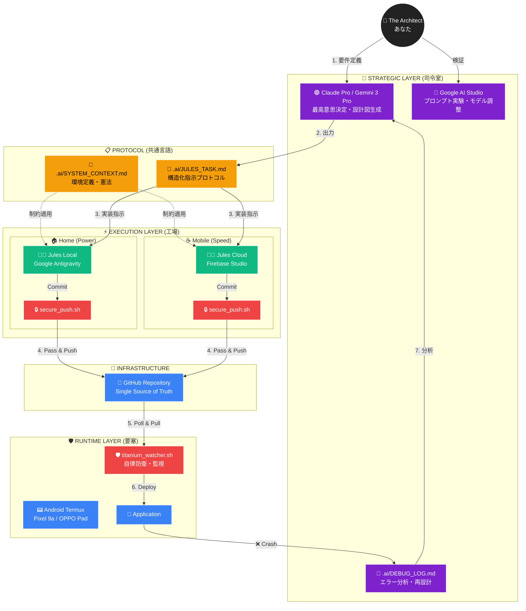
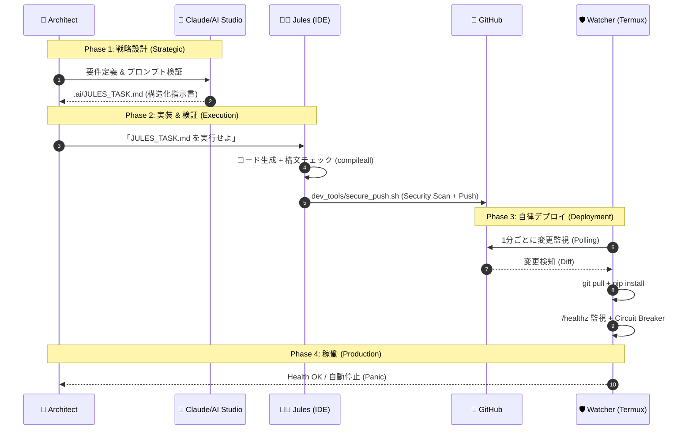

# 🏛️ Architecture & Workflow: AI Clipboard Pro v3.3 Titanium

## 1. System Overview (Structural View)

本プロジェクトは、**Strategic Layer (脳)** と **Execution Layer (手)** を明確に分離し、**Runtime Layer (現場)** の自律稼働を保証する「Titanium Architecture」を採用しています。

### 🌐 垂直統合ロールマップ (Vertical Integration)



---

## 2. Development Workflow (Temporal View)

開発からデプロイまでの時系列フロー。人間の介入はPhase 1に集中し、以降は自動化されます。

### ⏱️ The Titanium Loop



---

## 3. Core Principles (Titanium 3鉄則)

### ① Protocol First (「伝書鳩」からの卒業)

- **従来:** あなたがClaudeの回答を読み、要約してJulesに伝えていた。
- **現在:** Claudeが生成した `.ai/JULES_TASK.md` を、Julesが直接読み取る。
- **効果:** 指示の劣化（ハルシネーション）を防止。

### ② Environment Agnostic (開発拠点の完全同期)

- **自宅:** Antigravity IDEのJulesが `sync.sh start` で最新状態を取得。
- **外出先:** Firebase Studio (OPPO Pad/カフェ) で続きを実装。
- **結果:** どのデバイスでも常に最新のコードとAIの思考がある。

### ③ Titanium Shield (Termuxを「要塞」に)

- **監視:** `/healthz` を叩き、ゾンビ状態を検知。
- **防衛:** 無限再起動ループで発熱死を防ぐCircuit Breaker。
- **制約:** `SYSTEM_CONTEXT.md` によりTermux非互換ライブラリを排除。

---

## 4. Directory Structure

```
📁 Project Root
├── .ai/                    # Strategic Layer
│   ├── SYSTEM_CONTEXT.md   # Agent Constitution
│   ├── JULES_TASK.md       # Task Protocol
│   └── DEBUG_LOG.md        # Error Template
├── maintenance/            # Runtime Layer
│   └── titanium_watcher.sh # Auto-Deploy + Circuit Breaker
├── dev_tools/              # Dev Layer
│   ├── secure_push.sh      # Secret Scan
│   └── sync.sh             # Dev Ritual
├── github_agent/           # MCP Agent
└── main.py                 # Core App
```

---

## 5. Your Role: The Architect

1. **Claude** で「何を作るか（What）」を決定
2. **AI Studio** で「AIの言葉（Prompt）」の精度を極める
3. **Jules** に「作業（How）」を命じ、GitHubへ流し込ませる
4. **Titanium Watcher** が現場（Termux）を24時間守り抜く

このサイクルを回すことで、最小限の労力で最大限に堅牢なAIシステムを構築し続けることができます。
