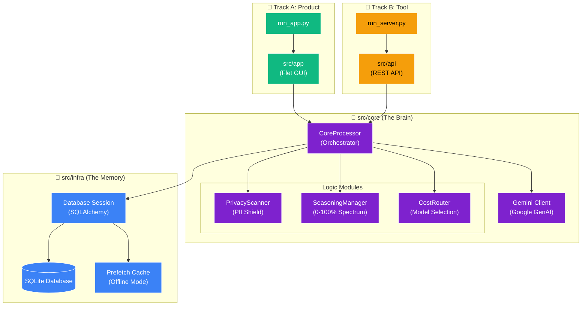
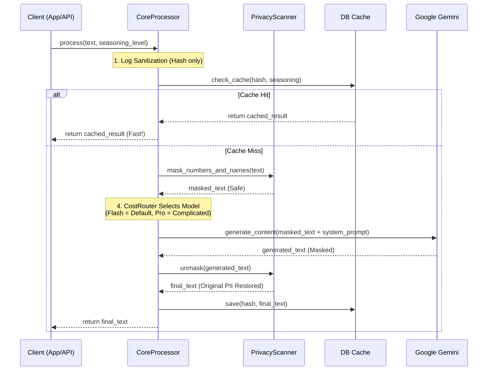

# 🏛️ Architecture: Flow AI v4.0 "Unified Core"

> **Version**: 4.0.0 (Seasoning Update)
> **Philosophy**: Unified Core Strategy - PCアプリとAPIサーバーは同じ「脳」を共有する。

---

## 1. System Overview (Structural View)

本システムは、**「素材の下処理 (Pre-processing)」** に特化したAI変換エンジンです。
Flet (GUI) と FastAPI (API) という2つの「顔」を持ちますが、中枢ロジックは完全に統一されています。

### 🌐 The Unified Core Diagram

---

## 2. Core Logic Sequence

Flow AIの中枢である `CoreProcessor` の処理フローです。
**「Zero Trust Privacy」** と **「Speed First」** を両立させるためのパイプライン構造になっています。

### 🌊 The Processing Pipeline

---

## 3. Directory Structure & Roles

### `src/core` (The Brain) 🧠

**「どこでも動く」純粋なロジック**。

* **`processor.py`**: パイプライン全体を制御する指揮者。PIIマスク、キャッシュ確認、AI呼び出しの順序を管理。
* **`seasoning.py`**: **v4.0の新概念**。離散的な「スタイル」ではなく、0〜100%の「味付け濃度」でプロンプトを動的に生成します。
  * 0-30% (Salt): 復元・修正のみ
  * 31-70% (Sauce): 整形・補完
  * 71-100% (Spice): 創造・拡張
* **`privacy.py`**: 正規表現によるPII（個人情報）の検出と置換。

### `src/infra` (The Memory) 💾

* **`database.py`**: SQLiteへの接続管理。WALモードを有効化し、並列書き込み性能を向上。

### `src/app` (The Face) 📱

* **`ui.py`**: Fletを使用したクロスプラットフォームUI。ロジックを持たず、CoreProcessorを呼び出すだけの「薄い」層。

---

## 4. Development Workflow

### 🔄 The "Unified" Cycle

1. **Logic Update**: `src/core/seasoning.py` のロジックを修正。
2. **Instant Reflection**: PCアプリ(App)とAPIサーバー(Server)の**両方に即座に反映**。
3. **Deployment**:
    * PC: `run_app.py`
    * Server: `run_server.py`

この「一箇所直せば全て直る」状態こそが、Unified Coreの真価です。
