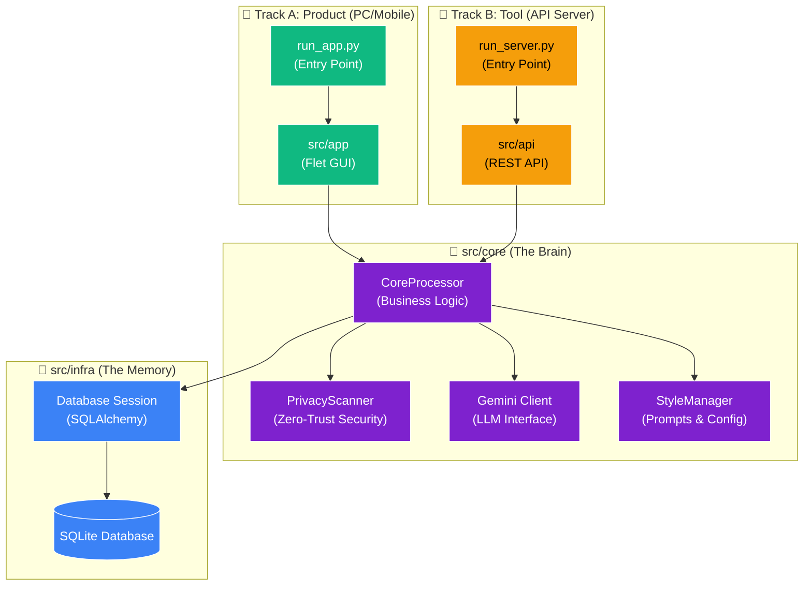

# 🏛️ Architecture & Workflow: AI Clipboard Pro v4.0 "Unified Core"

## 1. System Overview (Structural View)

本プロジェクトは、**Unified Core Strategy**により、すべてのアプリケーションが単一の「頭脳」を共有する構造に進化しました。これにより、PCアプリとAPIサーバー間のロジック乖離を永久に防ぎます。

### 🌐 The Unified Core Diagram

---

## 2. Directory Structure & Roles

### `src/core` (The Brain) 🧠

**「どこでも動く」純粋なロジック**のみを格納します。

* **依存禁止:** UIライブラリ(Flet)、Webフレームワーク(FastAPI)、OS依存機能(pyperclip)。
* **役割:**
  * `processor.py`: アプリケーションの全機能を統括。
  * `privacy.py`: 外部APIを叩く前の最後の砦（PII検知）。
  * `styles.py`: プロンプトエンジニアリングの集積地。

### `src/infra` (The Memory) 💾

データの永続化を担当します。

* `database.py`: DB接続セッションの管理。

### `src/app` (The Face) 📱

**ユーザーとの対話**を担当します。

* **Track A (Product):** PCおよびAndroidで動作するFletアプリ。
* ロジックは持たず、ユーザーの入力を `src/core` に渡し、結果を表示するだけです。

### `src/api` (The Gateway) 🔌

**外部システム連携**を担当します。

* **Track B (Tool):** Termuxや他ツールからのHTTPリクエストを受け付けます。
* FastAPIのエンドポイント定義のみを行い、処理は `src/core` に委譲します。

---

## 3. Development Workflow

### 🔄 The "Unified" Cycle

1. **Logic Update**: `src/core/styles.py` のプロンプトを修正すると...
2. **Instant Reflection**: PCアプリ(App)とAPIサーバー(Server)の**両方に即座に反映**されます。
3. **Deployment**:
    * PC: `run_app.py` で即起動。
    * Mobile: 将来的に `flet build apk` でビルド。
    * Server: `run_server.py` で常駐。

この「一箇所直せば全て直る」状態こそが、Unified Coreの真価です。
