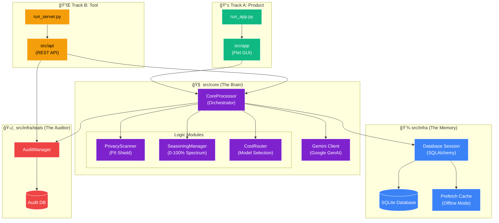
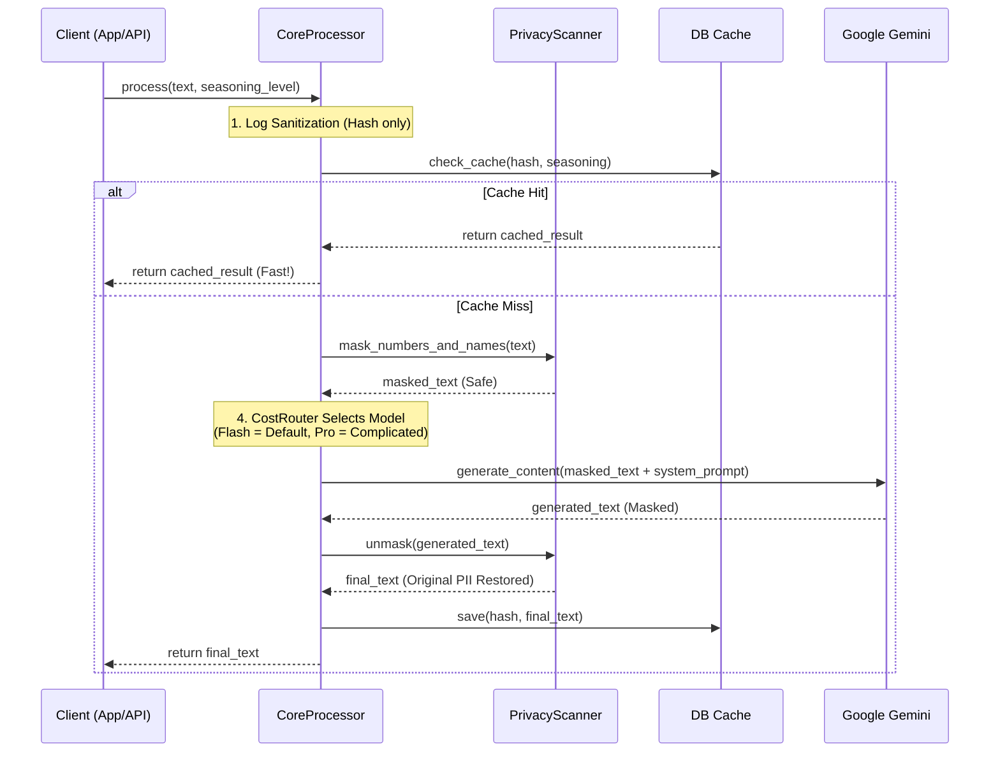

# ğŸ›ï¸ Architecture: Flow AI v4.0 "Unified Core"

> **Version**: 4.0.0 (Seasoning Update)
> **Philosophy**: Unified Core Strategy - PCアプリã¨APIサーãƒãƒ¼ã¯åŒã˜ã€Œè„³ã€ã‚’共有ã™ã‚‹ã€‚

---

## 1. System Overview (Structural View)

本システムã¯ã€**「素æã®ä¸‹å‡¦ç† (Pre-processing)ã€** ã«ç‰¹åŒ–ã—ãŸAI変æ›ã‚¨ãƒ³ã‚¸ãƒ³ã§ã™ã€‚
Flet (GUI) 㨠FastAPI (API) ã¨ã„ã†2ã¤ã®ã€Œé¡”ã€ã‚’æŒã¡ã¾ã™ãŒã€ä¸­æ¢ãƒ­ã‚¸ãƒƒã‚¯ã¯å®Œå…¨ã«çµ±ä¸€ã•ã‚Œã¦ã„ã¾ã™ã€‚

### 🌠The Unified Core Diagram

```mermaid
graph TD
    %% ==========================
    %% 1. THE BRAIN (Shared Core)
    %% ==========================
    subgraph "🧠 src/core (The Brain)"
        direction TB
        Processor["CoreProcessor<br>(Orchestrator)"]
        
        subgraph Logic Modules
            Privacy["PrivacyScanner<br>(PII Shield)"]
            Seasoning["SeasoningManager<br>(0-100% Spectrum)"]
            CostRouter["CostRouter<br>(Model Selection)"]
        end
        
        Gemini["Gemini Client<br>(Google GenAI)"]
    end

    %% ==========================
    %% 2. THE MEMORY (Infrastructure)
    %% ==========================
    subgraph "💾 src/infra (The Memory)"
        DB[(SQLite Database)]
        Session["Database Session<br>(SQLAlchemy)"]
        Cache["Prefetch Cache<br>(Offline Mode)"]
    end

    %% ==========================
    %% 3. THE INTERFACES (Tracks)
    %% ==========================
    subgraph "📱 Track A: Product"
        AppMain["run_app.py"]
        FletUI["src/app<br>(Flet GUI)"]
    end

    subgraph "🔌 Track B: Tool"
        ServerMain["run_server.py"]
        FastAPI["src/api<br>(REST API)"]
    end
    
    %% ==========================
    %% 4. THE AUDITOR (TEALS)
    %% ==========================
    subgraph "ğŸ›¡ï¸ src/infra/teals (The Auditor)"
        AuditManager["AuditManager"]
        AuditDB[(Audit DB)]
    end

    %% --- CONNECTIONS ---
    AppMain --> FletUI
    ServerMain --> FastAPI

    FletUI --> Processor
    FastAPI --> Processor

    Processor --> Privacy
    Processor --> Seasoning
    Processor --> CostRouter
    Processor --> Gemini
    Processor --> Session
    
    Session --> DB
    Session --> Cache
    
    %% Audit Connections
    Processor --> AuditManager
    AuditManager --> AuditDB
    FastAPI --> AuditManager

    %% Styles
    classDef core fill:#7e22ce,stroke:#fff,color:#fff;
    classDef infra fill:#3b82f6,stroke:#fff,color:#fff;
    classDef app fill:#10b981,stroke:#fff,color:#fff;
    classDef api fill:#f59e0b,stroke:#fff,color:#000;
    classDef audit fill:#ef4444,stroke:#fff,color:#fff;

    class Processor,Privacy,Seasoning,CostRouter,Gemini core;
    class DB,Session,Cache infra;
    class AppMain,FletUI app;
    class ServerMain,FastAPI api;
    class AuditManager,AuditDB audit;
```

---

## 2. Core Logic Sequence

Flow AIã®ä¸­æ¢ã§ã‚ã‚‹ `CoreProcessor` ã®å‡¦ç†ãƒ•ãƒ­ãƒ¼ã§ã™ã€‚
**「Zero Trust Privacyã€** 㨠**「Speed Firstã€** を両立ã•ã›ã‚‹ãŸã‚ã®ãƒ‘イプライン構造ã«ãªã£ã¦ã„ã¾ã™ã€‚

### 🌊 The Processing Pipeline

```mermaid
sequenceDiagram
    participant User as Client (App/API)
    participant Core as CoreProcessor
    participant Privacy as PrivacyScanner
    participant Cache as DB Cache
    participant Gemini as Google Gemini
    
    User->>Core: process(text, seasoning_level)
    
    %% 1. Sanitize Log
    Note over Core: 1. Log Sanitization (Hash only)
    
    %% 2. Cache Check
    Core->>Cache: check_cache(hash, seasoning)
    alt Cache Hit
        Cache-->>Core: return cached_result
        Core-->>User: return cached_result (Fast!)
    else Cache Miss
    
        %% 3. PII Masking
        Core->>Privacy: mask_numbers_and_names(text)
        Privacy-->>Core: masked_text (Safe)
        
        %% 4. Model Selection
        Note over Core: 4. CostRouter Selects Model<br>(Flash = Default, Pro = Complicated)
        
        %% 5. AI Generation
        Core->>Gemini: generate_content(masked_text + system_prompt)
        Gemini-->>Core: generated_text (Masked)
        
        %% 6. Unmasking
        Core->>Privacy: unmask(generated_text)
        Privacy-->>Core: final_text (Original PII Restored)
        
        %% 7. Save Cache
        Core->>Cache: save(hash, final_text)
        
        Core-->>User: return final_text
    end
```

---

## 3. Directory Structure & Roles

### `src/core` (The Brain) 🧠

**「ã©ã“ã§ã‚‚å‹•ãã€ç´”粋ãªãƒ­ã‚¸ãƒƒã‚¯**。

* **ä¾å­˜ç¦æ­¢:** UIライブラリ(Flet)ã€Webフレームワーク(FastAPI)ã€OSä¾å­˜æ©Ÿèƒ½(pyperclip)。
* **役割:**
  * `processor.py`: アプリケーションã®å…¨æ©Ÿèƒ½ã‚’統括。パイプライン全体を制御ã™ã‚‹æŒ‡æ®è€…。
  * `privacy.py`: 外部APIã‚’å©ãå‰ã®æœ€å¾Œã®ç ¦ï¼ˆPII検知）。正è¦è¡¨ç¾ã«ã‚ˆã‚‹PII検出ã¨ç½®æ›ã€‚
  * `seasoning.py`: **v4.0ã®æ–°æ¦‚念**。離散的ãªã€Œã‚¹ã‚¿ã‚¤ãƒ«ã€ã§ã¯ãªãã€0〜100%ã®ã€Œå‘³ä»˜ã‘濃度ã€ã§ãƒ—ロンプトを動的ã«ç”Ÿæˆã€‚
    * 0-30% (Salt): 復元・修正ã®ã¿
    * 31-70% (Sauce): 整形・補完
    * 71-100% (Spice): 創造・拡張

### `src/infra` (The Memory) 💾

データã®æ°¸ç¶šåŒ–を担当ã—ã¾ã™ã€‚

* `database.py`: DBæ¥ç¶šã‚»ãƒƒã‚·ãƒ§ãƒ³ã®ç®¡ç†ã€‚WALモードを有効化ã—ã€ä¸¦åˆ—書ãè¾¼ã¿æ€§èƒ½ã‚’å‘上。
* `audit.py` & `teals/`: **TEALS** (Tamper-Evident Audit Log System) ã«ã‚ˆã‚‹æ”¹ã–ん検知å¯èƒ½ãªç›£æŸ»ãƒ­ã‚°åŸºç›¤ã€‚
  * `audit_log.db` ã«ä¿ç®¡ã•ã‚Œã€ãƒãƒƒã‚·ãƒ¥ãƒã‚§ãƒ¼ãƒ³æŠ€è¡“ã§ãƒ‡ãƒ¼ã‚¿ã®å®Œå…¨æ€§ã‚’ä¿è¨¼ã—ã¾ã™ã€‚

### `src/app` (The Face) 📱

**ユーザーã¨ã®å¯¾è©±**を担当ã—ã¾ã™ã€‚

* **Track A (Product):** PCãŠã‚ˆã³Androidã§å‹•ä½œã™ã‚‹Fletアプリ。
* `ui.py`: Fletを使用ã—ãŸã‚¯ãƒ­ã‚¹ãƒ—ラットフォームUI。ロジックをæŒãŸãšã€CoreProcessorを呼ã³å‡ºã™ã ã‘ã®ã€Œè–„ã„ã€å±¤ã€‚

### `src/api` (The Gateway) 🔌

**外部システム連æº**を担当ã—ã¾ã™ã€‚

* **Track B (Tool):** Termuxや他ツールã‹ã‚‰ã®HTTPリクエストをå—ã‘付ã‘ã¾ã™ã€‚
* FastAPIã®ã‚¨ãƒ³ãƒ‰ãƒã‚¤ãƒ³ãƒˆå®šç¾©ã®ã¿ã‚’è¡Œã„ã€å‡¦ç†ã¯ `src/core` ã«å§”è­²ã—ã¾ã™ã€‚

---

## 4. Development Workflow

### 🔄 The "Unified" Cycle

1. **Logic Update**: `src/core/seasoning.py` ã®ãƒ­ã‚¸ãƒƒã‚¯ã‚’修正。
2. **Instant Reflection**: PCアプリ(App)ã¨APIサーãƒãƒ¼(Server)ã®**両方ã«å³åº§ã«å映**。
3. **Deployment**:
    * PC: `run_app.py`
    * Server: `run_server.py`

ã“ã®ã€Œä¸€ç®‡æ‰€ç›´ã›ã°å…¨ã¦ç›´ã‚‹ã€çŠ¶æ…‹ã“ããŒã€Unified Coreã®çœŸä¾¡ã§ã™ã€‚
