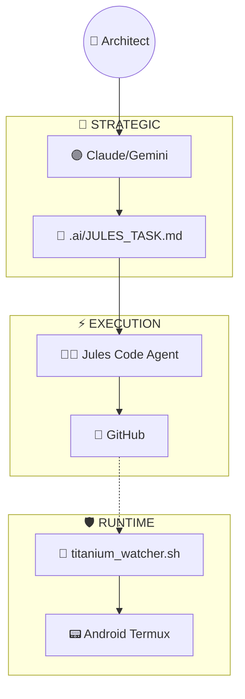

# AI Clipboard Pro v4.0 Titanium Edition

> 🚀 **From Script to App** - AI-powered clipboard processing with beautiful GUI

PCのパワフルな計算能力でGemini 3を動かし、スマホやPC自身からあらゆるテキストを「AI視点」で変換・整理するためのツールキットです。

## ✨ NEW: Flet GUI App (v4.0)

**HTTP Shortcutsなしで使える、統合GUIアプリが誕生！**

```powershell
# 起動方法
python flet_app/main.py
```

| Feature | Description |
|:--|:--|
| 🎨 **タイルUI** | 5つのスタイルをワンタップで選択 |
| 📜 **履歴** | 処理結果を自動保存、後から参照可能 |
| ⚡ **ストリーミング** | AIの回答をリアルタイム表示 |
| 🌊 **オンボーディング** | 初回起動時の親切なセットアップガイド |

## 🏛️ Architecture Overview



**詳細:** [ARCHITECTURE.md](ARCHITECTURE.md)

## 📁 Project Structure

```text
AI-Clipboard-Pro/
├── .env                # 環境変数 (Gemini API Key, Token) [ユーザー作成]
├── main.py             # FastAPIサーバー本体 (エンドポイント定義)
├── logic.py            # AI処理ロジック (Gemini 3対応) / PII検知
├── config.py           # アプリケーション設定 (モデル指定など)
├── models.py           # データモデル (SQLAlchemy / Pydantic)
├── database.py         # データベース接続 (SQLite)
├── requirements.txt    # 依存ライブラリ一覧
├── tasks.db            # データベースファイル
├── check_models.py     # 利用可能モデル確認ツール
├── cloudflared.exe     # Cloudflare Tunnel (外部公開用)
├── tunnel.log          # トンネル接続ログ
└── ... (各種ドキュメント)
```

## 🚀 Setup Guide (Windows)

最新の **Gemini 3 (google-genai v1.0 SDK)** に対応済みです。

### 1. Python環境の準備

Python 3.10以降が必要です。

```powershell
# 依存ライブラリのインストール
pip install -r requirements.txt
pip install google-genai  # 最新モデル使用に必須
```

### 2. 環境変数の設定

`.env` ファイルを作成し、APIキーを設定します。

```ini
# .env
GEMINI_API_KEY=AIzaSy...
# 必要に応じて変更 (gemini-3-flash-preview など)
# Configは config.py でも変更可能
```

### 3. サーバー起動

FastAPIサーバーを起動します。

```powershell
python main.py
```

起動すると `http://localhost:8000` でアクセス可能になります。

### 4. 外部公開 (Cloudflare Tunnel)

Androidから接続するために、Cloudflare Tunnelで外部公開URLを発行します。

```powershell
.\cloudflared.exe tunnel --url http://localhost:8000
```

ログ (`tunnel.log` またはコンソール) に表示される `https://xxxx-xxxx.trycloudflare.com` というURLをメモしてください。

## 📱 Android Setup

1. **HTTP Shortcuts** アプリなどをインストールします。
2. **新しいショートカット** を作成:
    * **Method:** POST
    * **URL:** `https://<あなたのトンネルURL>/process`
    * **Body Type:** JSON
    * **Body:** `{"text": "<クリップボードの内容>", "style": "business"}`
3. **変数の利用:** マクロツールを使う場合、クリップボードの内容を動的に `text` に埋め込むように設定してください。
4. テスト実行して、AIによる整形結果が返ってくれば成功です。

## 📚 Documentation

| ドキュメント | 内容 |
|:---|:---|
| [ARCHITECTURE.md](ARCHITECTURE.md) | システム設計・ワークフロー |
| [SETUP_GUIDE_TITANIUM.md](SETUP_GUIDE_TITANIUM.md) | Titanium Edition セットアップ |
| [USAGE_GUIDE.md](USAGE_GUIDE.md) | 使い方ガイド |

## 🛡️ Security Features

* **Rate Limiting**: 60 req/min per IP
* **PII Detection**: 日本/US/国際フォーマット対応
* **Secret Scanning**: `secure_push.sh` でAPIキー流出防止
* **Circuit Breaker**: クラッシュループ自動検知・停止

---
*AI Clipboard Pro v3.3 Titanium Edition - Built with 🧠 Claude + 👨‍💻 Jules*
