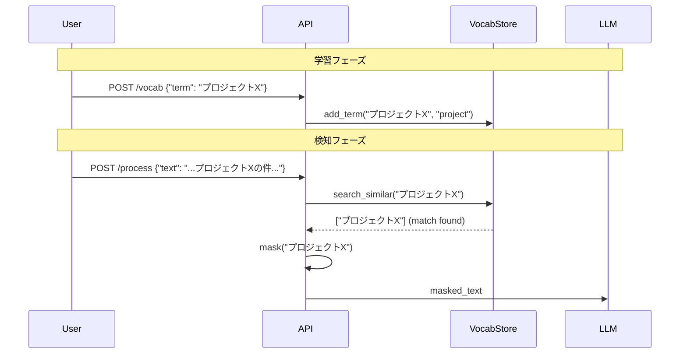

# RAGベース語彙学習 設計書

## 概要

ユーザー固有の機密語彙を学習し、セマンティック類似度で検知するシステム。

---

## コンポーネント

### 1. VocabularyStore

```python
class VocabularyStore:
    """カスタム語彙のベクトルストア"""
    
    def __init__(self, db_path: str = "./data/vocab.db"):
        self.db = chromadb.PersistentClient(path=db_path)
        self.collection = self.db.get_or_create_collection("sensitive_vocab")
    
    def add_term(self, term: str, category: str = "custom"):
        """機密語彙を追加"""
        self.collection.add(
            documents=[term],
            metadatas=[{"category": category}],
            ids=[f"{category}_{hash(term)}"]
        )
    
    def search_similar(self, text: str, threshold: float = 0.8) -> list[str]:
        """類似語彙を検索"""
        results = self.collection.query(
            query_texts=[text],
            n_results=10
        )
        return [doc for doc, dist in zip(results["documents"], results["distances"]) 
                if dist < threshold]
```

---

## データフロー



---

## ベクトルDB比較

| DB | メリット | デメリット |
|----|----------|-----------|
| **ChromaDB** | Python純正、セットアップ簡単 | 大規模非対応 |
| **FAISS** | 高速、Meta製 | C++依存、Termux要ビルド |
| **SQLite-VSS** | SQLite統合 | 精度やや劣る |

**推奨**: ChromaDB（Termux互換性高、Pure Python部分多い）

---

## API設計

```
POST /vocab          # 語彙追加
GET /vocab           # 語彙一覧
DELETE /vocab/{id}   # 語彙削除
POST /vocab/import   # 一括インポート
```

---

## 前提条件

- ChromaDB: `pip install chromadb`
- ストレージ: ~50MB/1万語彙
