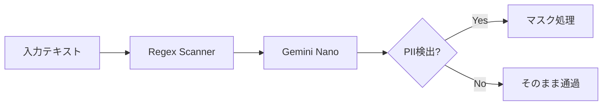

# Gemini Nano オンデバイスPII検知 設計書

## 概要

Regexでは捉えられない**文脈的PII**（プロジェクト名、社内用語等）を、ローカルLLM（Gemini Nano）で検出する設計。

---

## アーキテクチャ



---

## API設計

### SemanticPrivacyScanner

```python
class SemanticPrivacyScanner:
    """Gemini Nanoベースの文脈的PII検知"""
    
    def __init__(self, model_path: str = "gemini-nano"):
        self.model = load_nano_model(model_path)
    
    async def detect_contextual_pii(self, text: str) -> list[str]:
        """
        文脈的PIIを検出
        
        Returns:
            検出されたPIIリスト ["プロジェクトX", "山田部長" 等]
        """
        prompt = f"""
        以下のテキストから、個人や組織を特定できる情報を抽出してください:
        - 人名、役職名
        - プロジェクト名、製品名（社外秘の可能性）
        - 社内用語、略称
        
        テキスト: {text}
        
        JSON形式で出力: ["item1", "item2", ...]
        """
        return await self.model.generate(prompt)
```

---

## 統合フロー

```python
async def enhanced_mask_pii(text: str) -> tuple[str, dict]:
    # Phase 1: Regex (高速、確実)
    masked, mapping = mask_pii(text)
    
    # Phase 2: Semantic (オプション、高精度)
    if settings.SEMANTIC_PRIVACY_ENABLED:
        scanner = SemanticPrivacyScanner()
        contextual_pii = await scanner.detect_contextual_pii(masked)
        for pii in contextual_pii:
            placeholder = f"[SEMANTIC_PII_{len(mapping)}]"
            masked = masked.replace(pii, placeholder)
            mapping[placeholder] = pii
    
    return masked, mapping
```

---

## 前提条件

| 項目 | 要件 |
|------|------|
| SDK | `google-ai-edge` または同等 |
| モデルサイズ | ~200MB (量子化済み) |
| 推論時間 | <100ms/リクエスト |
| プラットフォーム | Android (Termux), Windows |

---

## 移行パス

1. **検証フェーズ**: Google AI Edge SDK の Termux 互換性確認
2. **プロトタイプ**: 単独スクリプトで精度検証
3. **統合**: `privacy.py` にオプショナル統合
